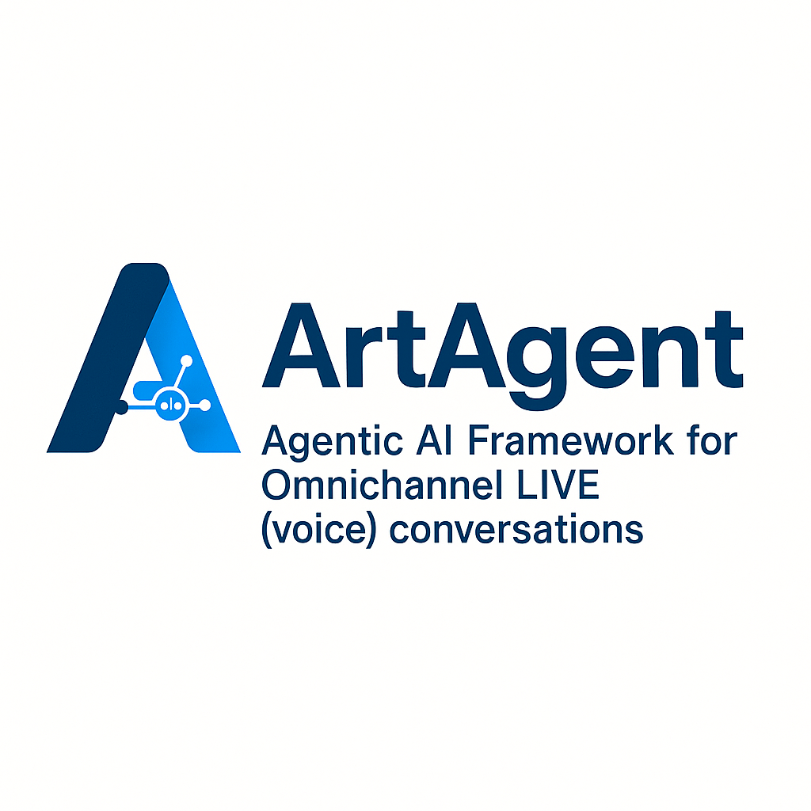
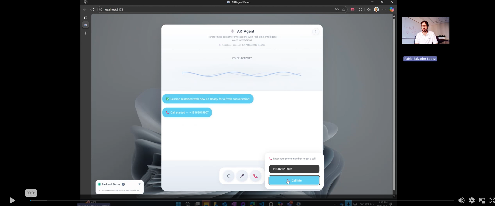

<!-- markdownlint-disable MD033 MD041 -->

# **ARTVoice Accelerator Framework**

> **TL;DR**: Build real-time voice agents on Azure—one hyperscale stack, omnichannel (ACS), code-first, modular, ops-friendly & extensible.



You own the agentic design; this repo handles the end-to-end voice plumbing. We keep a clean separation of concerns—telephony (ACS), app middleware, AI inference loop (STT → LLM → TTS), and orchestration—so you can swap parts without starting from zero. We know, shipping voice agents is more than “voice-to-voice.” You need predictable latency budgets, media handoffs, error paths, channel fan-out, barge-in, noise cancellation, and more. This framework gives you the e2e working spine so you can focus on what differentiates you— your tools, agentic design, and orchestration logic (multi-agent ready).

*Explore the full docs for tutorials, API, deployment guides & architecture patterns* -> https://azure-samples.github.io/art-voice-agent-accelerator/


<details closed>
<summary><h3>The what and why behind this accelerator</h3></summary>

## **What you get**

- **Omnichannel, including first-class telephony**. Azure Communication Services (ACS) integration for PSTN, SIP transfer, IVR/DTMF routing, and number provisioning—extendable for contact centers and custom IVR trees.

- **Transport that scales**. FastAPI + WebSockets for true bidirectional streaming; runs locally and scales out in Kubernetes. Leverages ACS bidirectional media streaming for low-latency ingest/playback (barge-in ready), with helper classes to wire your UI WebSocket client or loop back into ACS— the plumbing is done for you.

- **Model freedom**. Use GPT-family or your provider of choice behind a slim adapter; swap models without touching the transport.

- **Clear seams for customization**. Replace code, switch STT/TTS providers, add tool routers, or inject domain policies—without tearing down the whole app.

### **Choose your voice inference pipeline (voice‑to‑voice):**

- **Build from scratch (maximum control).** Use our AI inference layer and patterns to wire STT → LLM → TTS with your preferred Azure services and assessments. Own the event loop, intercept any step, and tailor latency/quality trade-offs for your use case. Ideal for on‑prem/hybrid, strict compliance, or deep customization.

- **Managed path (ship fast, enterprise‑ready).** Leverage the latest addition to the Azure AI family—Azure Voice Live API (preview)—for voice-to-voice media, and connect to Azure AI Foundry Agents for built-in tool/function calling. Keep your hooks; let Azure AI Foundry handle the media layer, scaling, noise suppression, and barge-in.

- **Bring your own voice‑to‑voice model.** Drop in your model behind(e.g., latest gpt‑realtime or equivalent). Transport/orchestration (including ACS telephony) stays the same—no app changes.

*The question of the century: Is it production-ready?*

“Production” means different things, but our intent is clear: this is an accelerator—it gets you ~80% of the way with battle-tested plumbing. You bring the last mile: hardening, infrastructure policies, security posture, SRE/DevOps, and your enterprise release process.

We ship the scaffolding to make that last mile fast: structured logging, metrics/tracing hooks, and a load-testing harness so you can profile end-to-end latency and concurrency, then tune or harden as needed to reach your target volume.

</details>

## **Demo, Demo, Demo..**

</br>

<div align="center">
  <a href="https://vimeo.com/1115976100">
    
  </a>
  <p style="font-size: smaller; font-family: cursive; font-style: italic; margin-top: 8px;">
    Click the image to watch the ARTAgent Demo.
  </p>
  
  <div style="margin: 20px auto; padding: 10px 15px; background: linear-gradient(135deg, #0078d4 0%, #106ebe 100%); border-radius: 15px; color: white; text-align: center; max-width: 400px; border: 2px solid #ffffff20; box-shadow: 0 4px 15px rgba(0,120,212,0.3);">
    <div style="font-size: 0.75em; font-weight: bold; margin-bottom: 3px;">Want to run this app?</div>
    <div style="font-size: 0.65em; margin-bottom: 5px;">All the code is here!</div>
    <div style="font-size: 0.6em; font-weight: normal; opacity: 0.9;">👇 Go to the "Getting Started" section below for step-by-step instructions</div>
  </div>
</div>

## **The How (Architecture)**

Pick one of three ways to run the voice inference layer—the rest of the framework (transport, orchestration, ACS telephony, UI wiring) stays the same. Choose based on control vs. speed vs. portability.

<details>
<summary><strong>Build the AI voice pipeline from scratch (maximum control)</strong></summary>
<br>


- **Own the event loop**: STT → LLM/Tools → TTS, with granular hooks.
- **Swap services per stage**: Azure Speech, Azure OpenAI, etc.
- **Tune for your SLOs**: latency budgets, custom VAD, barge-in, domain policies.
- **Deep integration**: ACS telephony, Event Hubs, Cosmos DB, FastAPI/WebSockets, Kubernetes, observability, custom memory/tool stores.
- **Best for**: on-prem/hybrid, strict compliance, or heavy customization.

</details>

<details>
<summary><strong>Use Azure Voice Live API + Azure AI Foundry Agents (ship fast)</strong></summary>
<br>

> [!NOTE]
> WIP/Preview: Azure Voice Live API is in preview; behavior and APIs may change.

<br>


 - **Enterprise Managed voice-to-voice**: barge-in, noise suppression, elastic scale.
 - **Agent runtime**: connect to Azure AI Foundry Agents for built-in tool/function calling and orchestration.
 - **Built-ins**: tool store, guardrails/evals, threads/memory patterns, APIM gateway options.
 - **Keep your hooks**: reduce ops surface and move faster to pilot/production.

 **Key differences vs. from-scratch**

 - Media layer and agent runtime are managed (less infra to own).
 - Faster “happy-path” to omnichannel via ACS, while still supporting your policies and extensions.
 - Great fit when you want speed, scale and consistency without giving up critical integration points.

</details>

<details>
<summary><strong>Bring your own voice-to-voice model (e.g., gpt-realtime) — coming soon</strong></summary>

> [!NOTE]
> Coming soon: This adapter path is under active development.

- Plug a BYO voice-to-voice model behind a slim adapter; no changes to transport/orchestration.
- ACS telephony path remains intact.


</details>

## **Getting started**

> [!TIP]
> Not an Infrastructure-as-Code person? Start by skimming the [deployment guide](docs/deployment/README.md). You've got two easy deployment paths—azd (one-command) or Terraform + Makefile—but you could also deploy the infrastructure from the Azure Portal UI or reuse your current infrastructure if it matches the requirements. Once your cloud resources are up, follow [`docs/getting-started/local-development.md`](docs/getting-started/local-development.md) for a step-by-step local run.

### **Understand the Repository map (high‑level)**

```
📁 apps/rtagent/           # Main application
  ├── 🔧 backend/          # FastAPI + WebSockets voice pipeline
  ├── 🌐 frontend/         # Vite + React demo client
  └── 📜 scripts/          # Helper launchers (backend, frontend, tunnel)
📁 src/                    # Core libraries (ACS, Speech, AOAI, Redis, Cosmos, VAD, tools, prompts)
📁 samples/                # Hands-on tutorials and examples (hello_world, labs)
📁 infra/                  # Infrastructure as Code
  ├── 🔷 bicep/            # Azure Bicep modules
  └── 🏗️ terraform/        # Terraform modules
📁 docs/                   # Guides and references (architecture, getting started, troubleshooting)
📁 tests/                  # Pytest suite and load testing framework
📁 utils/                  # Logging/telemetry helpers and images
```

> [!NOTE]
> Need a deeper map (up to 5 levels) and exact local run steps? See [`docs/guides/repository-structure.md`](docs/guides/repository-structure.md).

### **Deploy and Customize the Demo App Using the ARTAgent Framework**

Already have infra deployed? You can skip azd and run locally using the Quickstart — see [`docs/getting-started/local-development.md`](docs/getting-started/local-development.md).

> [!IMPORTANT]
> Prerequisites for azd deployment:
> - Azure Developer CLI installed and logged in (`azd auth login`)
> - Active subscription selected in Azure CLI (`az account show`)
> - Sufficient permissions to create resource groups and resources

Provision the complete Azure stack—including **App Gateway**, **Container Apps**, **Cosmos DB**, **Redis Cache**, **Azure OpenAI**, **Speech Services**, **Key Vault**, **Application Insights**, **Log Analytics**, **Azure Communication Services**, **Event Grid**, and **Storage Account**—with a single command:

```bash
azd auth login
azd up   # ~15 min for complete infra and code deployment
```

For a detailed deployment walkthrough, see [`docs/deployment/README.md`](docs/deployment/README.md).

## **Contributing**
PRs & issues welcome—see [`CONTRIBUTING.md`](CONTRIBUTING.md) before pushing.

## **License & Disclaimer**
Released under MIT. This sample is **not** an official Microsoft product—validate compliance (HIPAA, PCI, GDPR, etc.) before production use.

<br>

> [!IMPORTANT]  
> This software is provided for demonstration purposes only. It is not intended to be relied upon for any production workload. The creators of this software make no representations or warranties of any kind, express or implied, about the completeness, accuracy, reliability, suitability, or availability of the software or related content. Any reliance placed on such information is strictly at your own risk.