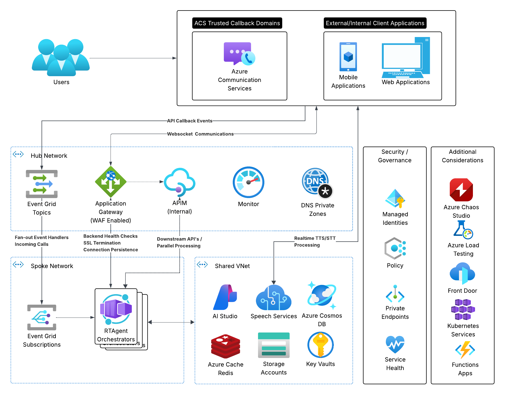
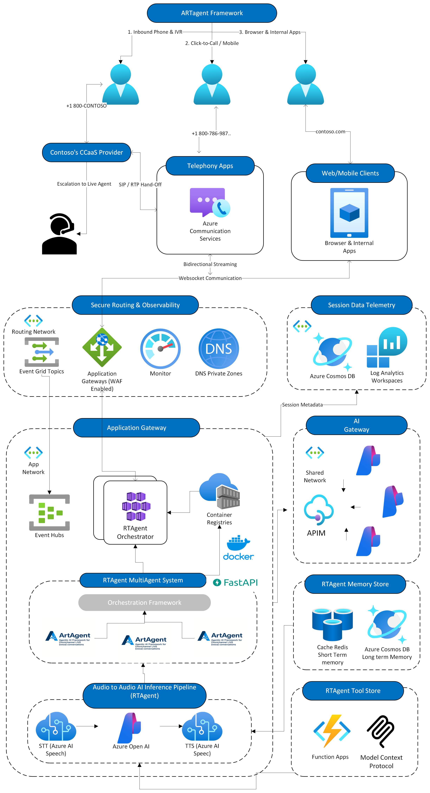
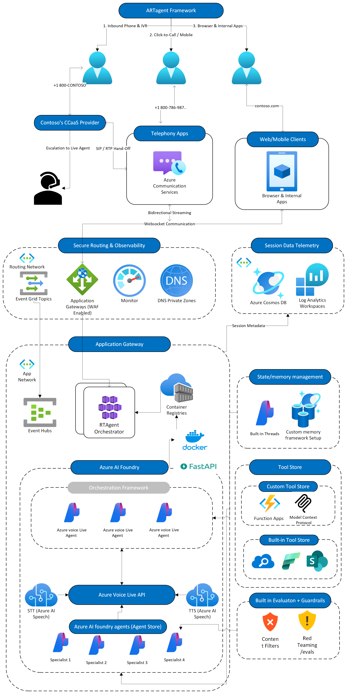
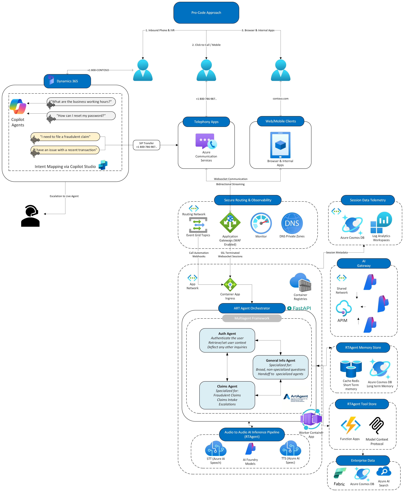

# :material-cube-outline: Architecture Overview

!!! abstract "Real-Time Voice AI Accelerator"
    Azure Communication Services voice agent accelerator with modular AI agents, real-time audio processing, and enterprise deployment patterns.

## :material-view-dashboard: Core Capabilities

| Feature | What's Included | Purpose |
|---------|-----------------|---------|
| **Real-time Audio** | ACS + Speech Services integration | Voice conversation processing |
| **AI Agent Framework** | Modular, swappable agent system | Industry-specific implementations |
| **Intelligent Barge-in** | Voice activity detection patterns | Natural conversation flow |
| **Serverless Scaling** | Container Apps with auto-scaling | Cost-effective, elastic hosting |
| **Development Ready** | Public endpoints with managed identity | Quick deployment and testing |

!!! abstract "Deployment Architecture Options"
    **Current Terraform**: Container Apps with public endpoints for rapid development
    
    **Available Bicep**: Enterprise production architecture with API Management, and private networking. (Advanced, WIP)

## :material-cloud-outline: Deployment Architecture
=== "🏗️ Simplified Azure Production"
    **Streamlined deployment with Container Apps and public endpoints**
    
    
    
    *Current Terraform deployment with Container Apps, AI Foundry, and public endpoints. App Gateway, APIM, and private networking are intentionally excluded to maintain simplicity and flexibility for rapid development.*

=== "🔧 Detailed Component View"
    **Agent framework and processing pipeline architecture**
    
    
    
    *Detailed view of the agent orchestration, processing components, and data flow patterns within the simplified production architecture.*

=== "🎙️ Voice Live Orchestration"
    **Real-time voice processing with live orchestration**
    
    
    
    *Voice live orchestration architecture showing real-time audio processing, conversation management, and agent coordination patterns.*

=== "🧩 Dynamics IVR Bridge"
    **Low-code intent mapping with Dynamics and ACS orchestration**
    
    
    
    *Dynamics 365 handles IVR intent mapping and automated workflows, then performs a SIP transfer bridge into Azure Communication Services for custom real-time orchestration with the RT Agent.*

!!! note "Infrastructure Deployment Approach"
    The Terraform deployment intentionally excludes App Gateway, API Management, and private networking to provide a **malleable foundation** that consumers can extend based on their specific requirements. Production enterprise features are available through separate Bicep templates.

*Azure infrastructure with Container Apps, AI Foundry, and public endpoints*

!!! info "Microsoft Learn Resources"
    - **[Azure Communication Services](https://learn.microsoft.com/en-us/azure/communication-services/overview)** - Core platform
    - **[Audio Streaming Concepts](https://learn.microsoft.com/en-us/azure/communication-services/concepts/call-automation/audio-streaming-concept)** - Real-time media
    - **[Container Apps](https://learn.microsoft.com/en-us/azure/container-apps/overview)** - Serverless hosting

!!! warning "Current Terraform Deployment"
    **Simplified Public Infrastructure** - The Terraform deployment creates a streamlined development-focused architecture with public endpoints and Container Apps hosting. Advanced features like API Management, AI Gateway, private networking, and Application Gateway are available in the Bicep templates for production scenarios.

## :material-network: Key Infrastructure Components

=== "Core Services (Terraform Deployed)"
    **Container Apps Environment:**
    
    - **Auto-scaling** - KEDA-based scaling for frontend and backend containers
    - **Public Ingress** - External endpoints for development and testing
    - **Managed Identity** - Azure AD authentication across all services
    - **Application Insights** - Centralized logging and monitoring
    
    **AI Services:**

    - **Azure AI Foundry** - LLM Model hosting, unified resource for Speech/Cognitive Services

    
    **Data Layer:**
    
    - **Cosmos DB (MongoDB API)** - Session and conversation storage
    - **Redis Enterprise** - High-performance caching with RBAC
    - **Storage Account** - Audio files and prompt storage
    - **Key Vault** - Secure secret management

=== "Production Extensions (Bicep Available)"
    **Advanced Networking:**
    
    - Hub-spoke VNet topology with private endpoints
    - Application Gateway with WAF protection  
    - NSG rules and traffic control
    
    **API Management & AI Gateway:**
    
    - Token management and PTU optimization
    - Load balancing and cost analytics
    - Content safety and multi-region routing
    
    !!! info "Deployment Comparison"
        **Terraform**: Streamlined development infrastructure with public endpoints and Container Apps
        
        **Bicep**: Enterprise-grade production architecture with private networking, API Gateway, and Application Gateway
        
        **Microsoft Learn References:**
        
        - **[Container Apps Architecture](https://learn.microsoft.com/en-us/azure/container-apps/overview)** - Serverless hosting patterns
        - **[AI Gateway Architecture](https://learn.microsoft.com/en-us/ai/playbook/technology-guidance/generative-ai/dev-starters/genai-gateway/reference-architectures/apim-based)** - Advanced API management (Bicep only)
        - **[Private Endpoint Integration](https://learn.microsoft.com/en-us/azure/container-apps/networking)** - Network security patterns (Bicep only)

## :material-compass: Architecture Deep Dives

| Document | Focus | What You'll Learn |
|----------|-------|-------------------|
| **[LLM Orchestration](llm-orchestration.md)** | AI routing and conversation management | Multi-agent coordination, dependency injection patterns, orchestrator design |
| **[Speech Recognition](speech-recognition.md)** | Real-time STT processing | Azure Speech integration, WebSocket handling, and transcription accuracy |
| **[Speech Synthesis](speech-synthesis.md)** | Dynamic TTS generation | Low-latency audio synthesis, voice font customization, and output streaming |
| **[ACS Call Flows](acs-flows.md)** | Three-thread voice processing | Real-time audio handling, WebSocket patterns, media lifecycle |
| **[Data Flows](data-flows.md)** | Storage and caching patterns | State management, Redis coordination, Cosmos DB persistence |
| **[Integrations](integrations.md)** | Cross-cloud connectivity | External service patterns, authentication flows |

## :material-rocket: Quick Start Paths

=== "👩‍💻 Developers"
    1. **[Getting Started](../getting-started/README.md)** - Environment setup and prerequisites
    2. **[Local Development](../getting-started/local-development.md)** - Run the accelerator locally
    3. **[API Reference](../api/README.md)** - Endpoints and WebSocket protocols
    
=== "🏗️ Architects"
    1. **[Data Flow Patterns](data-flows.md)** - Storage strategies and state management
    2. **[Production Deployment](../deployment/production.md)** - Infrastructure and scaling
    3. **[Integrations Overview](integrations.md)** - External service connectivity

=== "🔧 Operations"
    1. **[Monitoring Guide](../operations/monitoring.md)** - Application insights and observability
    2. **[Load Testing](../operations/load-testing.md)** - Performance validation and capacity planning
    3. **[Troubleshooting](../operations/troubleshooting.md)** - Issue resolution and debugging

!!! info "Additional Resources"
    For more comprehensive guidance on development and operations:
    
    - **[Repository Structure](../guides/repository-structure.md)** - Understand the codebase layout
    - **[Utilities & Services](../guides/utilities.md)** - Core infrastructure components
    - **[Deployment Guide](../deployment/README.md)** - Deploy the accelerator to Azure

---
