# :material-phone-in-talk: ACS Call Automation & Media Flows

!!! abstract "Three-Thread Voice Processing Architecture"
    Comprehensive architecture for Azure Communication Services (ACS) media handling, specifically designed for **real-time voice processing** with integrated **barge-in detection** capabilities.

## :material-microsoft-azure: Azure Communication Services Integration

!!! success "Enterprise Voice Processing"
    Azure Speech SDK provides continuous speech recognition optimized for real-time conversations with sub-10ms barge-in detection.

### :material-microphone: Speech Recognition Capabilities

| :material-feature-search: Feature | :material-information: Description | :material-speedometer: Accelerator Focus |
|------------|-------------|-------------|
| **Real-time Processing** | Immediate partial and final result processing | Low-latency patterns |
| **Barge-in Detection** | Advanced voice activity detection for interruptions | Reference implementation |
| **Multiple Result Types** | Partial results for speed, final results for accuracy | Flexible processing modes |
| **Session Management** | Automatic session handling with connection recovery | Robust connection patterns |
| **Continuous Recognition** | Persistent speech-to-text processing | 24/7 operation templates |

!!! info "Microsoft Learn Resources"
    - **[Audio Streaming Quickstart](https://learn.microsoft.com/en-us/azure/communication-services/how-tos/call-automation/audio-streaming-quickstart)** - Server-side audio streaming implementation
    - **[Call Automation SDK](https://learn.microsoft.com/en-us/azure/communication-services/quickstarts/call-automation/callflows-for-customer-interactions)** - Automated call routing solutions
    - **[Media Access Overview](https://learn.microsoft.com/en-us/azure/communication-services/concepts/voice-video-calling/media-access)** - Real-time media stream processing patterns
    - **[Speech to Text Service](https://learn.microsoft.com/en-us/azure/ai-services/speech-service/speech-to-text)** - Real-time speech recognition capabilities
    - **[Real-time Speech Recognition](https://learn.microsoft.com/en-us/azure/ai-services/speech-service/get-started-speech-to-text)** - Implementation patterns for continuous STT processing
    - **[Bidirectional Audio Streaming](https://learn.microsoft.com/en-us/azure/communication-services/concepts/call-automation/audio-streaming-concept)** - Two-way media streaming architecture
    - **[WebSocket Audio Processing](https://learn.microsoft.com/en-us/azure/communication-services/how-tos/call-automation/audio-streaming-quickstart#handling-audio-streams-in-your-websocket-server)** - Real-time audio stream handling patterns

## :material-sitemap: Three-Thread Processing Architecture

!!! tip "Thread Separation Strategy"
    The architecture separates concerns across three dedicated threads for optimal performance and reliability.


## Thread Responsibilities & Communication

### Core Design Principles

The three-thread architecture follows these key principles:

#### 🎤 **Speech SDK Thread** - Never Blocks
- **Continuous audio recognition** using Azure Speech SDK
- **Immediate barge-in detection** via `on_partial` callbacks
- **Cross-thread communication** via `run_coroutine_threadsafe`
- **Performance**: < 10ms response time for barge-in detection

#### 🔄 **Route Turn Thread** - Blocks Only on Queue
- **AI processing and response generation** through orchestrator
- **Queue-based serialization** of conversation turns
- **Safe cancellation** without affecting speech recognition
- **Performance**: Processes one turn at a time, can be cancelled

#### 🌐 **Main Event Loop** - Never Blocks
- **WebSocket handling** for real-time media streaming
- **Task cancellation** for barge-in scenarios
- **Non-blocking coordination** between threads
- **Performance**: < 50ms for task cancellation and stop commands

### Thread Performance Matrix

| Thread | Primary Role | Blocking Behavior | Barge-in Role | Response Time |
|--------|--------------|-------------------|---------------|--------------|
| **Speech SDK** | Audio recognition | ❌ Never blocks | ✅ Detection | < 10ms |
| **Route Turn** | AI processing | ✅ Queue operations only | ❌ None | Variable |
| **Main Event** | WebSocket & coordination | ❌ Never blocks | ✅ Execution | < 50ms |

## Implementation Flow

### Barge-in Detection and Handling

1. **User speaks during AI response**:
   - `on_partial()` callback fires immediately (< 10ms)
   - `ThreadBridge.schedule_barge_in()` schedules handler on main event loop
   - `MainEventLoop.handle_barge_in()` cancels current processing

2. **Task cancellation chain**:
   ```
   on_partial() → schedule_barge_in() → cancel_current_processing() → send_stop_audio()
   ```

3. **Speech finalization**:
   - `on_final()` callback queues completed speech via `ThreadBridge.queue_speech_result()`
   - `RouteTurnThread` picks up speech from queue
   - New AI processing task created for response generation

### Key Components

#### ThreadBridge
Provides thread-safe communication between Speech SDK Thread and Main Event Loop:
- `schedule_barge_in()` - Schedules barge-in handler execution
- `queue_speech_result()` - Queues final speech for processing
- Uses `run_coroutine_threadsafe` and `asyncio.Queue` for safe cross-thread communication

#### SpeechSDKThread
Manages Speech SDK in dedicated background thread:
- Pre-initializes `push_stream` to prevent audio data loss
- Never blocks on AI processing or network operations
- Provides immediate callback execution for barge-in detection

#### RouteTurnThread
Handles AI processing in isolated thread:
- Blocks only on `speech_queue.get()` operations
- Processes speech through orchestrator
- Creates and manages TTS playback tasks

#### MainEventLoop
Coordinates WebSocket operations and task management:
- Handles incoming media messages and audio data
- Manages barge-in interruption and task cancellation
- Never blocks to ensure real-time responsiveness
## 🔄 Non-Blocking Thread Communication Sequence

```mermaid
sequenceDiagram
    participant SpeechSDK as 🧵 Speech SDK Thread
    participant MainLoop as 🧵 Main Event Loop
    participant RouteLoop as 🧵 Route Turn Thread  
    participant ACS as 🔊 Azure Communication Services
    participant User as 👤 User

    Note over SpeechSDK,User: 🎵 AI Currently Playing Audio
    MainLoop->>ACS: 🔊 Streaming TTS Audio Response
    ACS->>User: 🎵 Audio Playback Active
    
    rect rgba(255, 149, 0, 0.15)
    Note over SpeechSDK,User: 🚨 USER SPEAKS (BARGE-IN EVENT)
    User->>SpeechSDK: 🗣️ Audio Input (Partial Recognition)
    
    Note right of SpeechSDK: ⚡ IMMEDIATE ACTION<br/>🚫 NO BLOCKING
    SpeechSDK->>SpeechSDK: 🔍 on_partial() callback triggered
    end
    
    rect rgba(255, 59, 48, 0.2)
    Note over SpeechSDK,MainLoop: 🔗 CROSS-THREAD COMMUNICATION
    SpeechSDK-->>MainLoop: 🚀 run_coroutine_threadsafe(_handle_barge_in_async)
    Note right of SpeechSDK: ✅ Speech thread continues<br/> NOT BLOCKED
    
    Note over MainLoop: 🛑 BARGE-IN HANDLER EXECUTES
    MainLoop->>MainLoop: ❌ playback_task.cancel()
    MainLoop->>MainLoop: 🧹 Clear route_turn_queue
    MainLoop->>ACS: 🛑 Send StopAudio command
    end
    
    rect rgba(52, 199, 89, 0.15)
    ACS-->>User: 🔇 Audio Playback STOPPED
    Note right of MainLoop: ✅ Previous AI response<br/>cancelled cleanly
    end
    
    rect rgba(0, 122, 255, 0.1)
    Note over SpeechSDK,RouteLoop: 📝 USER CONTINUES SPEAKING
    User->>SpeechSDK: 🗣️ Continues Speaking
    SpeechSDK->>SpeechSDK:  on_final() callback triggered
    
    Note over SpeechSDK,MainLoop: 🔗 FINAL RESULT COMMUNICATION
    SpeechSDK-->>MainLoop:  run_coroutine_threadsafe(_handle_final_async)
    MainLoop->>MainLoop:  route_turn_queue.put(final_text)
    Note right of SpeechSDK: ✅ Speech thread continues<br/>🚫 NOT BLOCKED
    end
    
    rect rgba(102, 51, 153, 0.1)
    Note over RouteLoop,ACS: 🤖 NEW AI PROCESSING
    RouteLoop->>RouteLoop: 📥 queue.get() receives final_text
    Note right of RouteLoop: ⏳ ONLY thread that blocks<br/>🎯 Dedicated AI processing
    
    RouteLoop->>MainLoop: 🎵 Create new playback_task
    MainLoop->>ACS: 🔊 Send New TTS Response
    ACS->>User: 🎵 Play New AI Response
    end
    
    Note over SpeechSDK,User: ✅ COMPLETE NON-BLOCKING CYCLE
```



### 🚀 Critical Non-Blocking Characteristics

| Event | Thread Source | Target Thread | Blocking? | Communication Method | Response Time |
|-------|---------------|---------------|-----------|---------------------|---------------|
| **🚨 Barge-in Detection** | Speech SDK | Main Event Loop | ❌ NO | `run_coroutine_threadsafe` | < 10ms |
| **📋 Final Speech** | Speech SDK | Route Turn Thread | ❌ NO | `asyncio.Queue.put()` | < 5ms |
| **🎵 AI Processing** | Route Turn | Main Event Loop | ❌ NO | `asyncio.create_task` | < 1ms |
| **🛑 Task Cancellation** | Main Event Loop | Playback Task | ❌ NO | `task.cancel()` | < 1ms |

> **🎯 Key Insight**: Only the **Route Turn Thread** blocks (on `queue.get()`), ensuring Speech SDK and Main Event Loop remain responsive for real-time barge-in detection.

---

## Key Implementation Details

This section provides **concrete implementation specifics** for developers working with the ACS Media Handler threading architecture.

### 🚨 Barge-In Detection

- **Trigger**: `on_partial` callback from Speech Recognizer detects user speech
- **Immediate Action**: Synchronous cancellation of `playback_task` using `asyncio.Task.cancel()`
- **Stop Signal**: Send `{"Kind": "StopAudio", "StopAudio": {}}` JSON command to ACS via WebSocket
- **Logging**: Comprehensive logging with emojis for real-time debugging

### 🔄 Async Background Task Management

- **Route Turn Queue**: Serializes final speech processing using `asyncio.Queue()`
- **Playback Task**: Tracks current AI response generation/playback with `self.playback_task`
- **Task Lifecycle**: Clean creation, cancellation, and cleanup of background tasks
- **Cancellation Safety**: Proper `try/except asyncio.CancelledError` handling

### 🛑 Stop Audio Signal Protocol
```json
{
  "Kind": "StopAudio",
  "AudioData": null,
  "StopAudio": {}
}
```
This JSON message is sent to ACS to immediately halt any ongoing audio playback.

### ⚡ Error Handling & Resilience

- **Event Loop Detection**: Graceful handling when no event loop is available
- **WebSocket Validation**: Connection state checks before sending messages
- **Task Cancellation**: Proper cleanup with `await task` after cancellation
- **Queue Management**: Full queue detection and message dropping strategies

### 📊 Performance Optimizations

- **Immediate Cancellation**: Barge-in triggers instant playback stop (< 50ms)
- **Background Processing**: Non-blocking AI response generation
- **Memory Management**: Proper task cleanup prevents memory leaks
- **Concurrent Safety**: Thread-safe queue operations for speech processing
