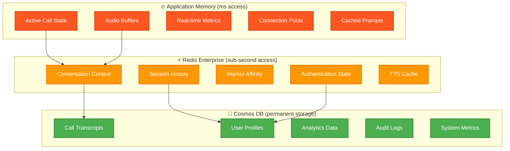
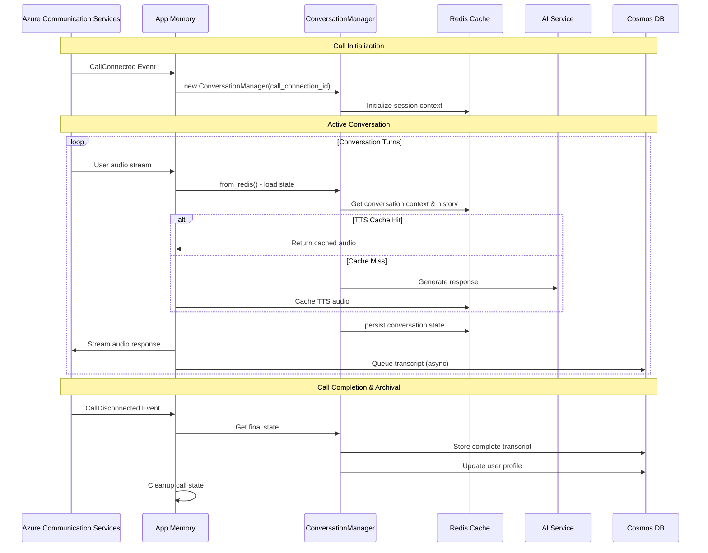

# :material-database-outline: Data Architecture & Flow Patterns

!!! abstract "Three-Tier Data Architecture"
    Sophisticated data architecture optimized for **real-time voice processing at scale** with hierarchical key organization, intelligent caching, and seamless data persistence for Azure Communication Services calls.

## :material-chart-timeline-variant: Architecture Overview

!!! success "Performance-Optimized Storage Strategy"
    The system employs a strategic **three-tier data storage hierarchy** optimized for different access patterns and performance requirements.

### :material-layers: Storage Hierarchy

| :material-speedometer: Tier | :material-timer: Access Time | :material-database: Use Cases | :material-chart-line: Capacity |
|------|-------------|-------------|------------|
| **🔥 Application Memory** | Microseconds | Active call state, audio buffers, real-time metrics | Limited by RAM |
| **⚡ Redis Enterprise** | Sub-second | Conversation context, session history, worker affinity | 10GB - 1TB |
| **📚 Cosmos DB** | 1-5 seconds | Persistent conversations, analytics, audit logs | Unlimited |

!!! info "Microsoft Learn Resources"
    - **[Azure Cache for Redis Overview](https://learn.microsoft.com/en-us/azure/azure-cache-for-redis/cache-overview)** - High-performance in-memory data store
    - **[Azure Cosmos DB Use Cases](https://learn.microsoft.com/en-us/azure/cosmos-db/use-cases)** - NoSQL database for modern applications
    - **[Azure Redis Key Scenarios](https://learn.microsoft.com/en-us/azure/azure-cache-for-redis/cache-overview#key-scenarios)** - Session store and caching patterns



### Storage Decision Matrix

| Data Type | Memory | Redis | Cosmos | Access Pattern | Reasoning |
|-----------|--------|-------|--------|----------------|-----------|
| **WebSocket Connections** | ✅ | ❌ | ❌ | High throughput | Process-specific, ultra-low latency |
| **Audio Buffers** | ✅ | ❌ | ❌ | Real-time | High-frequency, temporary |
| **Conversation Context** | ❌ | ✅ | ❌ | 10-50 ops/sec | Session persistence, shared workers |
| **TTS Cache** | ❌ | ✅ | ❌ | Variable | Shared across calls, time-limited |
| **Call Transcripts** | ❌ | ❌ | ✅ | 1-10 ops/min | Permanent record, analytics |
| **User Profiles** | ❌ | 🔄 | ✅ | Low frequency | Long-term, complex queries |

**Legend**: ✅ Primary storage, 🔄 Cached copy, ❌ Not stored

### Storage Layer Characteristics

#### 🔥 Application Memory (Milliseconds)
- **Purpose**: Ultra-low latency data for active calls
- **Examples**: Audio buffers, WebSocket connections, real-time metrics
- **Lifespan**: Seconds to minutes (call duration)
- **Access**: 100+ ops/second per call
- **Recovery**: Non-recoverable, rebuilt on restart

#### ⚡ Redis Enterprise (Sub-second)  
- **Purpose**: Session-scoped data shared across workers
- **Examples**: Conversation context, authentication state, TTS cache
- **Lifespan**: Minutes to hours (15min - 7 days TTL)
- **Access**: 10-50 ops/second per call
- **Recovery**: Critical, survives restarts

> **📚 Microsoft Learn Resources:**
> - [Azure Cache for Redis Reliability](https://learn.microsoft.com/en-us/azure/well-architected/service-guides/azure-cache-redis/reliability) - Best practices for enterprise Redis deployment
> - [Redis Session Store Pattern](https://learn.microsoft.com/en-us/azure/azure-cache-for-redis/cache-overview#key-scenarios) - Session management and caching strategies

#### 💾 Cosmos DB (Permanent)
- **Purpose**: Long-term storage, analytics, compliance
- **Examples**: Call transcripts, user profiles, audit logs
- **Lifespan**: Days to years (policy-driven retention)
- **Access**: 1-10 ops/minute for active calls
- **Recovery**: Permanent system of record

> **📚 Microsoft Learn Resources:**
> - [Global Data Distribution with Cosmos DB](https://learn.microsoft.com/en-us/azure/cosmos-db/distribute-data-globally) - Multi-region replication and consistency
> - [Azure Cosmos DB for NoSQL](https://learn.microsoft.com/en-us/azure/cosmos-db/nosql/overview) - Document storage with SQL-like queries

## Redis Key Architecture

### Hierarchical Key Structure
```
{app_prefix}:{environment}:{data_type}:{identifier}:{component}
```

**Examples**:
- `rtvoice:prod:call:call-connection-id-1234:session`
- `rtvoice:prod:conversation:session-id-5678:context`
- `rtvoice:dev:worker:worker-abc123:affinity`

### TTL Management Strategy
```python
TTL_POLICIES = {
    "conversation_context": 30 * 60,      # 30 minutes
    "session_history": 2 * 60 * 60,       # 2 hours
    "authentication_state": 15 * 60,      # 15 minutes
    "tts_cache": 24 * 60 * 60,           # 24 hours
    "call_summary": 7 * 24 * 60 * 60,    # 7 days (analytics)
}
```
## Implementation Patterns

### Core Components
1. **RedisKeyManager**: Hierarchical key structure and TTL management
2. **AsyncAzureRedisManager**: High-level async operations for conversation and call management  
3. **ConversationManager**: Conversation state with automatic legacy migration

### Usage Examples

```python
# ACS Call Session Setup
async def handle_call_connected(call_connection_id: str):
    session_key = redis_manager.key_manager.call_key(call_connection_id, Component.SESSION)
    await redis_manager.store_call_session(call_connection_id, session_data)

# Conversation Management with ConversationManager
async def setup_conversation(session_id: str = None):
    cm = ConversationManager(session_id=session_id, environment="prod")
    cm = await ConversationManager.from_redis(session_id, redis_mgr)
    await cm.update_context({"user_authenticated": True})
    await cm.append_to_history("user", "Hello")

# TTS Caching
async def cache_tts_response(phrase_hash: str, audio_data: bytes):
    key = f"rtvoice:prod:cache:tts:{phrase_hash}"
    await redis_manager.set_binary(key, audio_data, ttl=86400)
```

## Complete Call Lifecycle Flow



## Best Practices & Configuration

### Key Design Principles
- **Use `call_connection_id` as session_id** for ACS calls (no random UUIDs)
- **Batch Redis operations** for performance (pipeline transactions)
- **Implement graceful degradation** with fallback mechanisms
- **Monitor TTL expiration** for critical session data
- **Use async operations** throughout for non-blocking performance


### Monitoring & Production Readiness

#### Key Performance Metrics & Baselines

**Latency Baselines (Production SLA)**:

- Redis operations: p99 < 5ms, p95 < 2ms
- Memory-to-Redis persistence: < 10ms
- Redis-to-Cosmos archival: < 100ms
- End-to-end call setup: < 500ms

**Operational Metrics**:

- Key creation rate: Monitor spikes (>1000 keys/min indicates issues)
- TTL distribution: Alert on keys without TTL (potential memory leaks)
- Memory usage: Alert at 70% Redis memory capacity
- Connection pool exhaustion: Alert on >80% pool utilization
- Failed operations: Alert on >1% error rate per 5-minute window

#### Production Alerting Strategy

| Priority | Alert Type | Trigger Conditions | Response Time | Examples |
|----------|------------|-------------------|---------------|----------|
| **🚨 P0 - Critical** | Infrastructure Failure | • Redis unavailability >30s<br/>• Memory usage >85% (OOM risk)<br/>• Call setup failures >5% in 2 minutes<br/>• Security breach detection | **Immediate** | PagerDuty escalation<br/>On-call engineer response<br/>Auto-failover procedures |
| **⚠️ P1 - Warning** | Performance Degradation | • Latency p95 >5ms for 10+ minutes<br/>• TTL policy violations detected<br/>• Key growth +50% in 1 hour<br/>• Authentication failure spikes | **Next Business Day** | Email notifications<br/>Engineering team review<br/>Capacity planning review |
| **📊 P2 - Informational** | Operational Insights | • Capacity planning metrics<br/>• Usage pattern analysis<br/>• Performance trend reports<br/>• Routine health summaries | **Weekly Review** | Dashboard reports<br/>Quarterly business reviews<br/>Architecture optimization |

### Alert Configuration Details

```yaml
# P0 Critical Alert Thresholds
redis_availability:
    threshold: "availability degradation for 30 seconds"
    escalation: "page on-call immediately"

memory_pressure:
    threshold: "memory_usage > 85%"
    action: "trigger auto-scaling + immediate alert"

call_failure_rate:
    threshold: "failed_calls / total_calls > 0.05 over 2 minutes"
    severity: "business_critical"

# P1 Warning Alert Configuration  
performance_degradation:
    latency_p95: "> 5ms for 10 consecutive minutes"
    ttl_violations: "keys without TTL > 100"
    growth_anomaly: "key_count increase > 50% in 1 hour"
```

#### Security & Compliance Framework

**Infrastructure Security**:

- **Network**: Private endpoints, VNet integration, no public Redis access
- **Authentication**: Azure Managed Identity for service-to-service auth
- **Encryption**: TLS 1.3 in transit, customer-managed keys at rest
- **Access Control**: RBAC with principle of least privilege
- **Audit**: All Redis operations logged with correlation IDs

**Data Protection & PII Handling**:
```python
# PII Encryption Strategy
ENCRYPTED_FIELDS = {
    "conversation_context": ["user_id", "phone_number", "session_metadata"],
    "call_transcripts": ["transcript", "participant_info"],
    "user_profiles": ["personal_data", "preferences"]
}

# Automatic PII Detection & Masking
async def store_conversation_context(context: dict):
    masked_context = await pii_detector.mask_sensitive_data(context)
    encrypted_context = await crypto_service.encrypt_fields(masked_context, ENCRYPTED_FIELDS)
    await redis_manager.set_json(key, encrypted_context, ttl=TTL_POLICIES["conversation_context"])
```

**Compliance Controls**:

| Requirement | Implementation | Monitoring |
|-------------|----------------|------------|
| **Data Retention (GDPR)** | Automated TTL enforcement, scheduled purge jobs | Daily retention compliance reports |
| **Right to Erasure** | `delete_user_data()` API with cascade deletion | Audit log of deletion requests |
| **Data Minimization** | PII detection, automatic field masking | Weekly PII exposure scans |
| **Breach Notification** | Real-time security event monitoring | 72-hour breach notification workflow |

#### Operational Runbooks

**Incident Response Procedures**:

1. **Redis Performance Degradation**:
   ```bash
   # Check cluster health
   az redis show --resource-group $RG --name $REDIS_NAME
   
   # Monitor key distribution
   redis-cli --scan --pattern "rtvoice:prod:*" | wc -l
   
   # Check TTL compliance
   redis-cli eval "return redis.call('keys', 'rtvoice:prod:*')" 0 | xargs -I {} redis-cli TTL {}
   ```

2. **Security Incident Response**:
    - Immediate: Rotate Redis access keys
    - Within 1 hour: Audit all active sessions
    - Within 24 hours: Security assessment report
    - Within 72 hours: Compliance notification if required

#### Capacity Planning

- **Memory**: Scale Redis cluster at 70% utilization
- **Connections**: Monitor connection pool metrics, scale at 80%
- **Throughput**: Baseline 10K ops/sec per shard, alert on degradation

#### Health Check Implementation

```python
async def comprehensive_health_check():
    """Multi-tier health validation for production readiness"""
    health_status = {
        "redis_connectivity": await test_redis_connection(),
        "memory_usage": await check_redis_memory(),
        "key_expiration_compliance": await audit_ttl_policies(),
        "encryption_validation": await verify_pii_encryption(),
        "performance_baseline": await measure_operation_latency(),
        "security_posture": await validate_security_controls()
    }
    
    # Aggregate health score for load balancer
    overall_health = all(health_status.values())
    return {"status": "healthy" if overall_health else "degraded", "details": health_status}
```

**Production Deployment Checklist**:

- [ ] Redis cluster provisioned with HA configuration
- [ ] Private endpoints configured (no public access)
- [ ] Monitoring dashboards deployed (Azure Monitor + custom metrics)
- [ ] Alert rules configured for all critical thresholds
- [ ] Security scanning completed (vulnerability assessment)
- [ ] Compliance validation passed (data classification, retention policies)
- [ ] Disaster recovery tested (backup/restore procedures)
- [ ] Performance load testing completed (10x expected traffic)
- [ ] Incident response runbooks validated

---
