# :material-phone-dial: Telephony Integration with Existing IVR Systems

!!! abstract "Connecting Your Contact Center to Azure"
    This guide provides a detailed architecture for integrating an existing on-premises or cloud-based telephony system (PBX, IVR, Contact Center) with this accelerator. By leveraging **Azure Communication Services (ACS) Direct Routing** and a certified **Session Border Controller (SBC)**, you can seamlessly route calls to the AI voice agent while preserving your existing carrier relationships and infrastructure.

---

## :material-lan-connect: Core Concept: ACS Direct Routing

**ACS Direct Routing** is the key technology that enables a "Bring Your Own Carrier" (BYOC) model. It allows you to connect your own telephony trunks to Azure Communication Services through a certified SBC. This is the ideal pattern for enterprises that want to augment their existing contact center with Azure's advanced AI and voice capabilities without replacing their entire telephony infrastructure.

!!! info "Official Microsoft Documentation"
    - **[Azure Communication Services Direct Routing](https://learn.microsoft.com/en-us/azure/communication-services/concepts/telephony/direct-routing-provisioning)**
    - **[Infrastructure Requirements for Direct Routing](https://learn.microsoft.com/en-us/azure/communication-services/concepts/telephony/direct-routing-infrastructure)**
    - **[List of Certified Session Border Controllers (SBCs)](https://learn.microsoft.com/en-us/azure/communication-services/concepts/telephony/certified-session-border-controllers)**

---

## :material-sitemap: Integration Architecture & Call Flow

The following diagram illustrates how a call is routed from an existing IVR system to the Azure-based voice agent and potentially back to a human agent queue.

```mermaid
graph LR
    subgraph YourInfra [Your Infrastructure]
        PSTN[📞 PSTN]
        Carrier[🏢 Telecom Carrier]
        IVR[🤖 IVR / Contact Center]
        PSTN --> Carrier
        Carrier --> IVR
    end

    subgraph DMZEdge [DMZ / Network Edge]
        SBC[🛡️ Session Border Controller]
    end

    subgraph AzureCloud [Azure Cloud]
        ACS[🌐 ACS Direct Routing]
        AgentBackend[📱 Voice Agent Backend]
        ACS -->|3 Webhook Event| AgentBackend
        AgentBackend -->|4 WebSocket Media| ACS
    end

    IVR -->|1 SIP Transfer| SBC
    SBC -->|2 SIP over TLS| ACS
    AgentBackend -->|5 Initiate Transfer| ACS
    ACS -->|6 Route back| SBC
    SBC -->|7 Transfer to Queue| IVR

    classDef yourinfra fill:#f9f9f9,stroke:#333,stroke-width:2px
    classDef azurecloud fill:#eaf5ff,stroke:#0078d4,stroke-width:2px
    class IVR,Carrier,PSTN yourinfra
    class ACS,AgentBackend azurecloud
```



### Call Flow Steps
1.  **Initial Call & IVR Handling:** A customer calls a number that routes to your existing carrier and is answered by your current IVR or contact center platform.
2.  **Transfer to AI Agent:** Based on a menu selection or business logic, the IVR decides to transfer the call to the AI voice agent. It initiates a SIP transfer (INVITE) to a pre-configured number that points to the SBC. Custom SIP headers can be added here to pass context (e.g., customer ID, reason for call).
3.  **SBC to ACS Routing:** The SBC receives the SIP INVITE, validates it, and forwards it securely over TLS to the ACS Direct Routing interface.
4.  **ACS to Voice Agent Backend:** ACS receives the call and triggers a webhook (`IncomingCall`) to the voice agent backend. The backend answers the call and establishes a real-time media stream over WebSockets.
5.  **AI Conversation:** The voice agent backend processes the audio stream in real-time, using Azure Speech for transcription/synthesis and Azure OpenAI for responses.
6.  **Escalation to Human:** If the AI agent determines a human is needed, the backend uses the ACS Call Automation SDK to initiate a transfer. This sends a SIP REFER message back to the original IVR/contact center via the SBC.
7.  **Return to IVR/Agent Queue:** The SBC routes the call back to your contact center, placing the customer in a queue for a human agent, passing along any new context gathered by the AI.

---

## :material-format-list-checks: Configuration Steps

Integrating your existing telephony requires a few key configuration steps, primarily centered around the SBC and ACS.

=== "Step 1: Prerequisites"
    !!! warning "Before You Begin"
        Ensure you have the following in place before attempting integration:

        - **A Certified SBC:** Your Session Border Controller must be on the [list of SBCs certified for ACS Direct Routing](https://learn.microsoft.com/en-us/azure/communication-services/concepts/telephony/certified-session-border-controllers).
        - **Public IP and FQDN for SBC:** The SBC must have a public IP address and a Fully Qualified Domain Name (FQDN).
        - **Publicly Trusted Certificate:** The FQDN for the SBC must have a valid, publicly signed TLS certificate. Wildcard certificates are supported.
        - **Verified Domain:** You must add and verify the SBC's domain name within your Azure Communication Services resource. See [Validate Domain Ownership](https://learn.microsoft.com/en-us/azure/communication-services/how-tos/telephony/domain-validation).

=== "Step 2: Connect the SBC to ACS"
    Once the prerequisites are met, you connect your SBC to ACS. This process pairs the SBC with your ACS resource, making it a valid gateway for SIP traffic.

    1.  **Add the SBC in Azure:** In the Azure portal, navigate to your Communication Services resource and select **Direct routing** under "Voice Calling - PSTN". Add your SBC's FQDN and signaling port.
    2.  **Configure Voice Routes:** Create outbound voice routing rules that determine how calls are sent. For a simple setup, you can create a rule that sends all calls to your newly added SBC.
    3.  **Verify Connection:** After configuration, the SBC status should appear as "Online" in the Azure portal. This is verified by a successful exchange of SIP OPTIONS messages between ACS and your SBC.

    !!! tip "Troubleshooting SBC Connectivity"
        If the SBC does not come online, refer to the official [SBC Connectivity Issues Troubleshooting Guide](https://learn.microsoft.com/en-us/azure/communication-services/concepts/telephony/monitoring-troubleshooting-telephony/troubleshoot-tls-certificate-sip-options). Common issues relate to TLS certificates or firewall misconfigurations.

=== "Step 3: Contextual Call Transfer (IVR to AI)"
    To make the handoff from your IVR to the AI agent intelligent, you need to pass contextual data. This is typically done using custom SIP headers.

    - **In your IVR/PBX:** When initiating the transfer to the SBC, add custom SIP headers to the INVITE message. A common practice is to use `X-` prefixed headers.
      ```sip
      INVITE sip:+18005551234@sbc.yourcompany.com SIP/2.0
      ...
      X-Customer-ID: 12345
      X-Transfer-Reason: BillingInquiry
      ...
      ```
    - **In the Voice Agent Backend:** The ACS Call Automation SDK delivers these headers to your application as part of the `IncomingCall` event payload. You can access them to inform the agent's initial greeting or actions.
      ```python
      # Example in your event handler
      if event.type == "Microsoft.Communication.IncomingCall":
          call_connection_id = event.data.get("callConnectionId")
          custom_headers = event.data.get("customHeaders", {})
          customer_id = custom_headers.get("X-Customer-ID")
          
          # Use customer_id to fetch customer data before answering
          await answer_call_with_context(call_connection_id, customer_id)
      ```

=== "Step 4: Escalation & Transfer (AI to Human)"
    When the AI agent needs to escalate to a human, it uses the `transfer` action from the ACS Call Automation SDK.

    - The target of the transfer is a phone number corresponding to a human agent queue in your original contact center.
    - You can again pass context, this time from the AI conversation, back to the contact center using custom SIP headers.

      ```python
      # Example of transferring a call back to a human agent queue
      from azure.communication.callautomation import CallAutomationClient, SipHeaders

      # ... inside your agent logic
      
      target_pstn_number = "+18005559876" # Your human agent queue number
      
      custom_context = SipHeaders(
          custom_headers={
              "X-AI-Summary": "Customer confirmed identity and wants to dispute a charge."
          }
      )

      await call_automation_client.transfer_call(
          call_connection_id=call_connection_id,
          target_participant=PhoneNumberIdentifier(target_pstn_number),
          custom_context=custom_context
      )
      ```
    This sends a SIP REFER message back through the SBC, instructing your telephony system to route the call to the specified number, with the AI-generated summary included in the SIP headers for your agent desktop to display.
