# :material-brain: LLM Orchestration Architecture

!!! abstract "Agent-Based Conversation Orchestration"
    Two distinct orchestration approaches: **Custom Multi-Agent** with local dependency injection and **Voice Live API** with Azure AI Foundry-managed orchestration.

## :material-select-group: Orchestration Approaches

=== "🎯 Custom Multi-Agent (MEDIA/TRANSCRIPTION)"
    **Local orchestration** with full developer control
    
    - **Orchestration**: Local dependency injection and agent registry
    - **Configuration**: YAML-based agent definitions (ARTAgent + FoundryAgent)
    - **Tools**: Custom function calling and business logic
    - **Control**: Complete customization of conversation flow
    - **Implementation**: Fully implemented with examples

=== "⚡ Voice Live API (VOICE_LIVE)"
    **Azure AI Foundry-managed orchestration** for simplified deployment
    
    !!! warning "Implementation Status"
        Voice Live orchestration is **offloaded to Azure AI Foundry agents**. Local orchestration (dependency injection, agent registry) described in this document applies only to Custom Multi-Agent modes.
        
        **LVAgent integration** (see [`apps/rtagent/backend/src/agents/Lvagent/`](https://github.com/Azure-Samples/art-voice-agent-accelerator/tree/main/apps/rtagent/backend/src/agents/Lvagent) directory) is **pending full implementation**.
    
    - **Orchestration**: Managed by Azure AI Foundry (not local)
    - **Configuration**: Azure AI agent configurations
    - **Tools**: Azure AI native capabilities
    - **Control**: Configuration-driven through Azure portal
    - **Implementation**: LVAgent framework in development

## :material-sitemap: Dependency Injection Pattern

!!! info "Scope: Custom Multi-Agent Orchestration Only"
    The dependency injection, agent registry, and orchestration patterns described below apply **only to Custom Multi-Agent modes** (MEDIA/TRANSCRIPTION).
    
    **Voice Live API** orchestration is handled entirely by Azure AI Foundry agents - see [`apps/rtagent/backend/src/agents/Lvagent/`](https://github.com/Azure-Samples/art-voice-agent-accelerator/tree/main/apps/rtagent/backend/src/agents/Lvagent) for the integration layer.

**Simple Function-Based Orchestration:**

```python title="apps/rtagent/backend/api/v1/dependencies/orchestrator.py"
def get_orchestrator() -> callable:
    """FastAPI dependency provider for conversation orchestrator."""
    return route_conversation_turn

async def route_conversation_turn(cm, transcript, ws, **kwargs):
    """Route conversation through agent registry with error handling."""
    await route_turn(cm=cm, transcript=transcript, ws=ws, is_acs=True)
```

**Usage in Endpoints:**

```python title="apps/rtagent/backend/api/v1/endpoints/media.py"
@router.websocket("/stream")
async def acs_media_stream(websocket: WebSocket):
    orchestrator = get_orchestrator()  # Inject orchestrator function
    
    handler = await _create_media_handler(
        orchestrator=orchestrator,  # Pass to handler
        # ... other params
    )
```

**Plug-and-Play Orchestration:**

```python title="Swappable Orchestration Strategies"
def get_orchestrator() -> callable:
    # return route_conversation_turn      # Default ARTAgent routing  
    # return route_turn_for_fnol         # Insurance-specific routing
    # return custom_conversation_handler # Custom business logic
    return route_conversation_turn
```

## :material-cogs: Agent Configuration System

### ARTAgent Framework (YAML-Driven)

!!! example "Authentication Agent Configuration"
    ```yaml title="apps/rtagent/backend/src/agents/artagent/agent_store/auth_agent.yaml"
    agent:
      name: AuthAgent
      description: Handles caller authentication and routing
    
    model:
      deployment_id: gpt-4o
      temperature: 1
      max_completion_tokens: 2040
    
    voice:
      name: en-US-Ava:DragonHDLatestNeural
      style: chat
      rate: "+5%"  # Slower for authentication clarity
    
    prompts:
      path: voice_agent_authentication.jinja
    
    tools:
      - authenticate_caller
      - escalate_emergency
      - escalate_human
    ```

!!! example "Claims Intake Agent Configuration"  
    ```yaml title="apps/rtagent/backend/src/agents/artagent/agent_store/claim_intake_agent.yaml"
    agent:
      name: FNOLIntakeAgent
      description: First Notice of Loss claim processing
    
    model:
      deployment_id: gpt-4o
      temperature: 0.60
    
    voice:
      name: en-US-Andrew2:DragonHDLatestNeural
      rate: "+10%"  # Faster for efficient data collection
    
    tools:
      - record_fnol
      - authenticate_caller
      - escalate_emergency
      - handoff_general_agent
    ```

### FoundryAgent Framework (Instructions-Based)

!!! example "Customer Service Agent Configuration"
    ```yaml title="apps/rtagent/backend/src/agents/foundryagents/agent_store/customer_service_agent.yaml"
    agent:
      name: CustomerServiceAgent
      instructions: |
        Professional customer service agent for e-commerce company.
        Help customers resolve inquiries quickly and accurately.
    
    model:
      deployment_id: gpt-4o
    
    tools:
      - check_order_status
      - search_knowledge_base
      - create_support_ticket
      - escalate_to_human
    ```

## :material-database: Agent Registry System

**Dynamic Agent Registration:**

```python title="apps/rtagent/backend/src/orchestration/artagent/registry.py"
# Registry for pluggable agents
_REGISTRY: Dict[str, AgentHandler] = {}

def register_specialist(name: str, handler: AgentHandler) -> None:
    """Register an agent handler under a name."""
    _REGISTRY[name] = handler

def get_specialist(name: str) -> Optional[AgentHandler]:
    """Lookup a registered agent handler.""" 
    return _REGISTRY.get(name)
```

**Agent Lookup Flow:**

```python title="apps/rtagent/backend/src/orchestration/artagent/orchestrator.py" 
async def route_turn(cm, transcript, ws, *, is_acs: bool):
    # 1. Check active agent from memory
    active_agent = cm.get_context("active_agent", "General")
    
    # 2. Get handler from registry
    handler = get_specialist(active_agent)
    
    # 3. Execute specialized processing
    if handler:
        await handler(cm, transcript, ws, is_acs=is_acs)
    else:
        await fallback_handler(cm, transcript, ws, is_acs=is_acs)
```

## :material-tools: Tool Integration Patterns

### ARTAgent Tools

```python title="apps/rtagent/backend/src/agents/artagent/tool_store/auth.py"
async def authenticate_caller(caller_name: str, phone_number: str):
    """Authenticate caller identity."""
    # Implementation for caller verification
    pass

async def escalate_emergency(reason: str, caller_name: str = None):
    """Emergency escalation for 911-type situations."""
    # Implementation for emergency routing
    pass
```

### FoundryAgent Tools

```python title="apps/rtagent/backend/src/agents/foundryagents/tool_store/customer_support_tools.py"
async def check_order_status(order_id: str):
    """Get real-time order information."""
    # Implementation for order lookup
    pass

async def create_support_ticket(issue_description: str, customer_info: dict):
    """Create support ticket for complex issues."""
    # Implementation for ticket creation
    pass
```

## :material-call-split: Orchestration Flow

```mermaid
sequenceDiagram
    participant WS as WebSocket
    participant Orch as Orchestrator
    participant Reg as Agent Registry
    participant Agent as Specialized Agent
    participant AI as Azure AI Foundry
    
    WS->>Orch: Audio → Transcript
    Orch->>Reg: Lookup Active Agent
    Reg-->>Orch: Return Handler
    Orch->>Agent: Execute Agent Logic
    Agent->>AI: LLM Request + Tools
    AI-->>Agent: Response + Function Calls
    Agent-->>WS: TTS Audio Response
```



## :material-compare: Mode Comparison

| **Aspect** | **Custom Multi-Agent** | **Voice Live API** |
|------------|------------------------|--------------------|
| **Orchestration** | Local (this document) | Azure AI Foundry managed |
| **Configuration** | YAML agent definitions | Azure AI agent configs |
| **Dependency Injection** | FastAPI dependencies | Not applicable |
| **Agent Registry** | Local registry system | Azure AI managed |
| **Tool Integration** | Custom function calling | Azure AI native |
| **Agent Switching** | Dynamic via local registry | Azure AI routing |
| **Implementation** | Fully implemented | LVAgent integration pending |

## :material-code-json: Configuration Examples

### Environment Configuration

```bash title="Orchestration Mode Selection"
# Multi-Agent Orchestration
export ACS_STREAMING_MODE=MEDIA
export ACS_STREAMING_MODE=TRANSCRIPTION

# Voice Live API  
export ACS_STREAMING_MODE=VOICE_LIVE
export VOICE_LIVE_AGENT_YAML="path/to/agent.yaml"
```

### Custom Agent Development

```python title="Creating New Agents"
# 1. Create YAML configuration
# agents/custom/my_agent.yaml

# 2. Implement agent handler
async def my_agent_handler(cm, utterance, ws, *, is_acs):
    # Custom agent logic
    pass

# 3. Register with orchestrator
register_specialist("MyAgent", my_agent_handler)

# 4. Set as active agent
cm.set_context("active_agent", "MyAgent")
```

## :material-link-variant: Integration Points

### Custom Multi-Agent Integration Files:

- **[`apps/rtagent/backend/api/v1/dependencies/orchestrator.py`](https://github.com/Azure-Samples/art-voice-agent-accelerator/blob/main/apps/rtagent/backend/api/v1/dependencies/orchestrator.py)** - Dependency injection provider
- **[`apps/rtagent/backend/src/orchestration/artagent/orchestrator.py`](https://github.com/Azure-Samples/art-voice-agent-accelerator/blob/main/apps/rtagent/backend/src/orchestration/artagent/orchestrator.py)** - Main routing logic
- **[`apps/rtagent/backend/src/orchestration/artagent/registry.py`](https://github.com/Azure-Samples/art-voice-agent-accelerator/blob/main/apps/rtagent/backend/src/orchestration/artagent/registry.py)** - Agent registration system  
- **[`apps/rtagent/backend/src/agents/artagent/agent_store/`](https://github.com/Azure-Samples/art-voice-agent-accelerator/tree/main/apps/rtagent/backend/src/agents/artagent/agent_store)** - ARTAgent YAML configurations
- **[`apps/rtagent/backend/src/agents/foundryagents/agent_store/`](https://github.com/Azure-Samples/art-voice-agent-accelerator/tree/main/apps/rtagent/backend/src/agents/foundryagents/agent_store)** - FoundryAgent YAML configurations
- **[`apps/rtagent/backend/src/agents/*/tool_store/`](https://github.com/Azure-Samples/art-voice-agent-accelerator/tree/main/apps/rtagent/backend/src/agents)** - Function calling implementations

### Voice Live API Integration (Pending):

- **[`apps/rtagent/backend/src/agents/Lvagent/`](https://github.com/Azure-Samples/art-voice-agent-accelerator/tree/main/apps/rtagent/backend/src/agents/Lvagent)** - LVAgent framework for Voice Live integration
- **[`apps/rtagent/backend/src/agents/Lvagent/factory.py`](https://github.com/Azure-Samples/art-voice-agent-accelerator/blob/main/apps/rtagent/backend/src/agents/Lvagent/factory.py)** - Agent factory for Voice Live mode
- **[`apps/rtagent/backend/src/agents/Lvagent/agent_store/`](https://github.com/Azure-Samples/art-voice-agent-accelerator/tree/main/apps/rtagent/backend/src/agents/Lvagent/agent_store)** - Voice Live agent configurations

!!! warning "Voice Live API Status"
    LVAgent integration is **under development**. Current Voice Live mode uses basic passthrough to Azure AI Foundry. Full orchestration capabilities will be available when LVAgent implementation is complete.

### Extension Patterns (Custom Multi-Agent Only):

- **Custom Agents** - Add new YAML configs and register handlers
- **Tool Integration** - Extend tool registries with business logic  
- **Orchestration Logic** - Modify routing strategies in orchestrator
- **Dependency Injection** - Swap orchestration functions in provider

This architecture enables **rapid agent development** through YAML configuration while maintaining **full extensibility** through the registry and dependency injection patterns for Custom Multi-Agent modes.