# Real-Time Voice Agent Documentation Hub

!!! tip "Welcome to the Complete Guide"
    This documentation covers everything you need to deploy, operate, and extend the Azure-based Real-Time Voice Agent with **Python 3.11 + FastAPI** and enterprise-grade Azure integrations.

## :material-rocket: Quick Start

=== "🚀 New Users"
    Start here for basic setup and deployment:
    
    1. **[Getting Started Guide](getting-started/README.md)** - Installation & basic usage
    2. **[Local Development](getting-started/local-development.md)** - Development workflow  
    3. **[Deployment Guide](deployment/README.md)** - Azure deployment with azd

=== "🏗️ Architects"
    Understand the system design:
    
    1. **[Architecture Overview](architecture/README.md)** - System architecture
    2. **[Data Flows](architecture/data-flows.md)** - Redis & Cosmos DB architecture
    3. **[ACS Integration](architecture/acs-flows.md)** - Three-thread voice processing

=== "🔧 Operators"
    Deploy and monitor in production:
    
    1. **[Production Deployment](deployment/production.md)** - Production checklist
    2. **[Monitoring Guide](operations/monitoring.md)** - Application Insights setup
    3. **[Troubleshooting](operations/troubleshooting.md)** - Common issues & solutions

## :material-map: Navigation Guide

| Guide | Description |
|-------|-------------|
| [Quick Start Guide](getting-started/README.md) | Complete setup and basic usage examples |
| [Local Development](getting-started/local-development.md) | Local development setup and testing |
| [Configuration Guide](getting-started/configuration.md) | Advanced configuration options |
| [Deployment Guide](deployment/README.md) | Complete Azure deployment with Terraform/azd |
| [Architecture Overview](architecture/README.md) | System architecture and design decisions |
| [Troubleshooting](operations/troubleshooting.md) | Common issues and solutions |

### :material-book-open: By Topic

!!! info "Microsoft Learn Integration"
    Documentation includes comprehensive [Microsoft Learn](https://learn.microsoft.com) references with validated links to official Azure documentation, samples, and best practices.

=== "🏗️ Architecture & Design"
    **Core System Design**
    
    - **[Architecture Overview](architecture/README.md)** - Enterprise Azure infrastructure & logical design
    - **[ACS Flows](architecture/acs-flows.md)** - Three-thread voice processing architecture  
    - **[Data Flows](architecture/data-flows.md)** - Redis & Cosmos DB three-tier storage
    - **[Cross-Cloud Integration](architecture/integrations.md)** - Azure/AWS integration patterns
    - **[LLM Orchestration](architecture/llm-orchestration.md)** - AI model routing & conversation flows

=== "🚀 Deployment & Operations"
    **Production Deployment**
    
    - **[Deployment Guide](deployment/README.md)** - Complete Azure deployment with `azd`
    - **[Production Checklist](deployment/production.md)** - Security, scaling & monitoring
    - **[CI/CD Pipeline](deployment/cicd.md)** - Automated deployment workflows
    - **[Monitoring & Observability](operations/monitoring.md)** - Application Insights integration
    - **[Troubleshooting](operations/troubleshooting.md)** - Diagnostic guides & solutions
    - **[Load Testing](operations/load-testing.md)** - Performance validation strategies
    - **[Testing Framework](operations/testing.md)** - Comprehensive testing approach

=== "🔧 Development & API"
    **Development Resources**
    
    - **[Getting Started](getting-started/README.md)** - Quick setup & basic usage
    - **[Local Development](getting-started/local-development.md)** - Development environment
    - **[Configuration Guide](getting-started/configuration.md)** - Environment & service setup
    - **[API Reference](api/README.md)** - Complete REST & WebSocket API documentation  
    - **[Interactive API Docs](api/api-reference.md)** - OpenAPI specification with testing

=== "📚 Reference & Utilities"
    **Supporting Documentation**
    
    - **[Speech Synthesis](reference/speech-synthesis.md)** - Azure Speech TTS integration
    - **[Speech Recognition](reference/speech-recognition.md)** - Azure Speech STT capabilities
    - **[Streaming Modes](reference/streaming-modes.md)** - Audio processing pipelines
    - **[Utilities & Tools](reference/utilities.md)** - Helper services & infrastructure
    - **[Repository Structure](reference/repository-structure.md)** - Codebase organization
    - **[Authentication Guide](security/authentication.md)** - Security & session management

=== "🏥 Industry Solutions"
    **Domain-Specific Guides**
    
    - **[Healthcare Solutions](industry/healthcare.md)** - HIPAA-compliant voice applications
    - **[Samples & Examples](samples/README.md)** - Implementation examples & tutorials

## Diagram Highlights

- Production reference: [Architecture Overview – Production Deployment](architecture/README.md#production-deployment-architecture) (image: `assets/RTAudio.v0.png`)
- Data lifecycle: [Data Flows – Call Lifecycle](architecture/data-flows.md#complete-call-lifecycle-flow) with interactive Mermaid sequence diagrams
- Contact center routing: [ACS Flows](architecture/acs-flows.md) featuring step-by-step diagrams and Mermaid flows
- Authentication flows: [Authentication Guide](security/authentication.md#authentication-flow-diagram) detailing OAuth and shared access tokens

## :material-sitemap: Architecture Overview

!!! abstract "Enterprise-Grade Voice AI Platform"
    Built on **Azure Communication Services**, **Azure OpenAI**, and **Azure Speech Services** with FastAPI backend architecture.

```mermaid
graph TB
    subgraph "📞 Communication Layer"
        Phone[📱 Phone/PSTN]
        Browser[🌐 Web Browser]
        Teams[👥 MS Teams]
    end
    
    subgraph "⚡ Azure Services"
        ACS[🔗 Azure Communication Services<br/>Call Automation & Media Streaming]
        Speech[🗣️ Azure Speech Services<br/>STT/TTS + Real-time Processing]  
        OpenAI[🧠 Azure OpenAI<br/>GPT-4o + Realtime API]
        Redis[⚡ Azure Cache for Redis<br/>Session State & Coordination]
        Cosmos[🗄️ Azure Cosmos DB<br/>Conversation History]
    end
    
    subgraph "🏗️ Application Platform"
        Apps[📦 Azure Container Apps<br/>FastAPI Backend + React Frontend]
        Monitor[📊 Azure Monitor<br/>Application Insights & Tracing]
    end
    
    Phone --> ACS
    Browser --> ACS 
    Teams --> ACS
    ACS <--> Speech
    ACS <--> Apps
    Speech <--> Apps
    Apps <--> OpenAI
    Apps <--> Redis
    Apps <--> Cosmos
    Apps --> Monitor
    
    classDef communication fill:#e1f5fe,stroke:#01579b,stroke-width:2px,color:#000
    classDef azure fill:#fff3e0,stroke:#e65100,stroke-width:2px,color:#000
    classDef platform fill:#f3e5f5,stroke:#4a148c,stroke-width:2px,color:#000
    
    class Phone,Browser,Teams communication
    class ACS,Speech,OpenAI,Redis,Cosmos azure
    class Apps,Monitor platform

```

!!! tip "Microsoft Learn Resources"

    - [Azure Communication Services Architecture](https://learn.microsoft.com/en-us/azure/communication-services/concepts/call-automation/audio-streaming-concept) - Real-time media streaming concepts
    - [Azure Developer CLI Templates](https://learn.microsoft.com/en-us/azure/developer/azure-developer-cli/get-started) - Deployment automation with `azd up`
    - [Azure Container Apps](https://learn.microsoft.com/en-us/azure/container-apps/overview) - Serverless container platform

## :material-compass: Next Steps

!!! success "Choose Your Learning Path"
    Select the path that matches your role and experience level:

=== "🆕 First Time Setup"
    **New to the project? Start here:**
    
    1. **[Getting Started Guide](getting-started/README.md)** - Complete setup walkthrough
    2. **[Architecture Overview](architecture/README.md)** - Understand the system design 
    3. **[Deployment Guide](deployment/README.md)** - Deploy with `azd up` in 15 minutes
    4. **[API Reference](api/README.md)** - Explore the REST and WebSocket APIs

=== "🏗️ Platform Engineers"
    **Infrastructure and operations focus:**
    
    1. **[Production Deployment](deployment/production.md)** - Enterprise deployment checklist
    2. **[Monitoring Setup](operations/monitoring.md)** - Application Insights configuration
    3. **[Security Guide](security/authentication.md)** - Authentication & session management  
    4. **[Troubleshooting](operations/troubleshooting.md)** - Diagnostic playbooks

=== "👨‍💻 Solution Developers"
    **Integration and customization:**
    
    1. **[Local Development](getting-started/local-development.md)** - Dev environment setup
    2. **[Cross-Cloud Integration](architecture/integrations.md)** - Azure/AWS patterns
    3. **[Healthcare Solutions](industry/healthcare.md)** - Domain-specific implementations
    4. **[Speech Services](reference/speech-synthesis.md)** - Advanced voice capabilities

!!! info "Microsoft Learn Learning Paths"
    Complement this documentation with official Microsoft learning resources:
    
    - **[Azure Communication Services Learning Path](https://learn.microsoft.com/en-us/training/paths/azure-communication-services/)** - Comprehensive ACS training
    - **[Azure Developer CLI Fundamentals](https://learn.microsoft.com/en-us/azure/developer/azure-developer-cli/overview)** - Master `azd` deployment workflows  
    - **[Azure Container Apps](https://learn.microsoft.com/en-us/training/paths/deploy-applications-azure-container-apps/)** - Container orchestration on Azure
