# Healthcare Voice Agent Use Cases

## Voice Agent Platform for Healthcare

```mermaid
flowchart TD
    %% Business Drivers
    subgraph Business ["🎯 Healthcare Business Drivers"]
        A["💰 Cost Pressures"]
        B["📋 Documentation Burden"]
        C["🏥 Care Complexity"]
    end

    %% Healthcare Solutions
    subgraph Solutions ["🏥 Voice Agent Solutions"]
        D["🎭 Virtual Care"]
        E["📝 Real-time Docs"]
        F["⚕️ Patient Monitoring"]
        G["🔐 Prior Auth"]
        H["🔬 Trial Screening"]
        I["🧭 Health Navigation"]
        M["🗣️ EMR Voice Interface"]
    end

    %% Technical Platform
    subgraph Platform ["⚡ Voice Agent Platform"]
        
        %% Voice Layer
        J["🎙️ Voice Processing<br/>ACS | Speech | OpenAI"]
        
        %% Agent Layer
        K["🤖 AI Agents<br/>🩺 Medical | 🛡️ Insurance | 🎯 Routing"]
        
        %% Integration Layer
        L["🔌 Integrations<br/>🏥 Clinical | 💰 Payer | 💾 Data | 📋 EMR"]
    end

    %% Connections
    Business --> Solutions
    Solutions --> J
    J --> K
    K --> L

    %% Styling
    classDef business fill:#3498db,stroke:#2c3e50,stroke-width:2px,color:#ffffff
    classDef solution fill:#2ecc71,stroke:#27ae60,stroke-width:2px,color:#ffffff
    classDef tech fill:#e67e22,stroke:#d35400,stroke-width:2px,color:#ffffff

    class A,B,C business
    class D,E,F,G,H,I,M solution
    class J,K,L tech
```

## Healthcare Voice Agent Use Cases

*Powered by Azure Communication Services & AI*

### Clinical Care & Patient Services

| # | Use Case | Who Benefits | How ACS Powers It | Business Impact |
|:---:|-------------|-------------------|----------------------|---------------------|
| 1 | Nurse Triage Hotline | Patients seeking symptom guidance | PSTN → Call Automation routes to AI triage Real-time speech → symptom analysis Seamless handoff to on-call nurse via Teams | 30-50% reduction in routine calls Faster patient care |
| 2 | Smart Appointment Scheduling | Outpatient clinics & scheduling teams | 24/7 bot handles inbound calls/texts FHIR integration for real-time slot availability Automated SMS/email confirmations | 10-15% reduction in no-shows 24/7 self-service availability |
| 5 | Post-Discharge Follow-Up | Care management & readmission teams | Event Grid triggers after EHR discharge Automated vitals surveys via ACS calls Alert escalation to nurses via Teams | 5-10% readmission reduction Proactive care monitoring |
| 6 | Crisis Mental Health Line | Behavioral health services | 24/7 hotline with sentiment analysis Auto-conference licensed counselors High-risk phrase detection & escalation | Faster crisis intervention 988 compliance ready |

---

### Pharmacy & Prior Authorization

| # | Use Case | Who Benefits | How ACS Powers It | Business Impact |
|:---:|-------------|-------------------|----------------------|---------------------|
| 3 | Prescription Refill & Prior-Auth | Pharmacies & PBM operations | IVR captures Rx numbers automatically Azure Speech + LUIS for intent recognition Smart escalation for complex cases | 40 seconds average handle time reduction Automated routine requests |
| 9 | Insurance Verification & Appeals | Revenue cycle operations | Self-service IVR with GPT explanations Auto-generated appeal letter drafts Intelligent case routing | Faster reimbursements Reduced manual processing |

---

### Specialized Services

| # | Use Case | Who Benefits | How ACS Powers It | Business Impact |
|:---:|-------------|-------------------|----------------------|---------------------|
| 4 | On-Demand Interpreters | Emergency departments & inpatient units | Language detection via Speech services Three-way calls with remote interpreters Live captioning + real-time translation | Joint Commission LEP compliance No onsite interpreter staff needed |
| 7 | Clinical Documentation Assistant | Physicians & medical coders | Real-time audio transcription AI-generated SOAP notes + CPT/ICD codes Direct EHR integration via HL7/FHIR | 2-4 minutes saved per encounter Higher coding accuracy |
| 8 | Rural Tele-Consult Network | Community hospitals & specialists | Emergency-triggered specialist calls Teams integration with screen sharing DICOM viewer support in same session | Faster critical decisions Lower transfer costs |
| 10 | Secure Research Study Hotline | Clinical trial coordinators | Unique numbers per study arm Encrypted recordings in Key Vault Power BI dashboards for PIs | HIPAA-compliant participant engagement Auditable research processes |

---

### Platform Benefits Summary

| Operational Excellence | Clinical Impact | Financial Results |
|:-------------------------:|:------------------:|:--------------------:|
| 24/7 Availability | Faster Care Delivery | Cost Reduction |
| Automated Workflows | Better Outcomes | Revenue Protection |
| Enterprise Security | Improved Experience | Compliance Ready |

---

> **Legend — Key ACS building blocks used**  
> Call Automation, WebSocket media streaming, Teams interop, Azure Speech & OpenAI, Event Grid, Cosmos DB, API Management, App Gateway / WAF.

### Core Azure Building Blocks

| Component | Purpose |
|-----------|---------|
| Call Automation | Programmable voice workflows |
| WebSocket Media Streaming | Real-time audio processing |
| Teams Interop | Seamless handoffs to live agents |
| Azure Speech & OpenAI | STT/TTS and intelligent responses |
| Event Grid | Trigger-based automation |
| Cosmos DB | Patient data and session state |
| API Management | Secure healthcare integrations |
| App Gateway / WAF | Enterprise security and routing |

