# Authentication Guide

This document outlines the authentication and session management strategy for the real-time voice agent application that integrates Azure Communication Services (ACS) with external telephony systems.

## Table of Contents

1. [Architecture Overview](#architecture-overview)
2. [Authentication Flow Diagram](#authentication-flow-diagram)
3. [Call Flow Types](#call-flow-types)
   - [PSTN Flow (with DTMF Authentication)](#pstn-flow)
   - [SIP Flow (with DTMF Authentication)](#sip-flow)  
   - [API Flow (with Direct Lookup)](#api-flow)
4. [WebSocket Authentication](#websocket-authentication)
5. [Session Key Management](#session-key-management)
6. [Security Architecture](#security-architecture)
7. [Technical References](#technical-references)

---

## Architecture Overview

The system uses **Azure Communication Services Call Automation** as the unified media processing layer with three distinct authentication mechanisms:

- **🔐 DTMF Authentication**: For PSTN and SIP calls using media tone analysis
- **🔑 Direct Lookup**: For API calls using call connection IDs
- **📦 Redis Session Store**: Centralized session management across all flows

### Key Components

- **Event Grid Integration**: Delivers `IncomingCall` events with webhook callbacks
- **Call Automation REST API**: Asynchronous interface for call control  
- **Session Border Controllers (SBCs)**: Certified SBCs for Direct Routing
- **WebSocket Security**: Custom token validation for real-time media
- **AWS Connect Integration**: Cross-cloud session handoff using Resume Contact API

---

## Authentication Flow Diagram

```mermaid
flowchart LR
  %% Style Definitions
  classDef acs fill:#e0e7ff,stroke:#4f46e5,stroke-width:2px,color:#312e81
  classDef backend fill:#fef3c7,stroke:#d97706,stroke-width:2px,color:#92400e
  classDef storage fill:#dbeafe,stroke:#2563eb,stroke-width:2px,color:#1e40af
  classDef external fill:#fed7aa,stroke:#ea580c,stroke-width:2px,color:#9a3412
  classDef event fill:#fce7f3,stroke:#db2777,stroke-width:2px,color:#831843
  classDef dtmf fill:#ecfeff,stroke:#0891b2,stroke-width:2px,color:#164e63

  %% Call Flows
  subgraph SIP["📱 SIP Flow"]
    SIP1[📞 SIP User] --> SIP2[☁️ AWS Connect]
    SIP2 --> SIP3[🔧 Enterprise SBC] --> SIP4[📡 ACS SIP]
  end

  subgraph PSTN["📞 PSTN Flow"]
    PSTN1[📞 Caller] --> PSTN2[☁️ AWS Connect]
    PSTN2 --> PSTN3[🔧 Telco SBC] --> PSTN4[📡 ACS PSTN]
  end

  subgraph API["🧑‍💻 API Flow"]
    API1[🧑‍💻 Client] --> API2[🔐 EasyAuth] --> API3[⚡ /api/call]
    API3 --> API4[📡 ACS Automation]
  end

  %% Authentication Engine
  subgraph AUTH["🎵 Authentication Engine"]
    D1[🔎 Analyze DTMF Media]
    D2[🔍 Lookup Session Key]
    D3{✅ Key exists?}
    D4[✅ Authorize WebSocket]
    D5[❌ Reject Connection]
    D3 -- Yes --> D4
    D3 -- No --> D5
  end

  %% Backend & Storage
  subgraph Backend["🧠 Backend Orchestrator"]
    WS[🔌 WebSocket Handler]
    TV[🛡️ Token Validation]
  end
  
  Redis[(🗄️ Redis Store)]

  %% Flow Connections
  SIP4 --> D1
  PSTN4 --> D1
  API4 --> D2
  D1 --> D2
  D2 --> D3
  D4 --> WS
  WS --> TV --> Redis

  %% Session Storage
  SIP2 -->|store sip:call_id| Redis
  PSTN2 -->|store pstn:ani:code| Redis
  API3 -->|store call_connection_id| Redis

  %% Styling
  class SIP1,SIP2,SIP3,PSTN1,PSTN2,PSTN3,API1,API2,API3 external
  class SIP4,PSTN4,API4 acs
  class D1,D2,D3,D4,D5 dtmf
  class WS,TV backend
  class Redis storage
```

## Call Flow Types

### PSTN Flow
**Authentication Method**: DTMF Media Analysis

1. **Call Setup**: Caller → AWS Connect IVR → SBC → ACS PSTN
2. **Session Storage**: AWS Connect stores `pstn:ani:code` in Redis
3. **Authentication**: DTMF analysis extracts caller ANI and codes
4. **Validation**: System checks Redis for matching composite key
5. **Authorization**: Valid sessions proceed to WebSocket handler

### SIP Flow  
**Authentication Method**: DTMF Media Analysis

1. **Call Setup**: SIP Client → Enterprise SBC → ACS SIP Interface
2. **Session Storage**: SBC stores `sip:call_id` in Redis
3. **Authentication**: DTMF analysis extracts SIP call identifier
4. **Validation**: System validates against stored session key
5. **Authorization**: Authenticated calls establish media streaming

### API Flow
**Authentication Method**: Direct Call Connection ID Lookup

1. **Call Setup**: Client → `/api/call` endpoint → ACS Call Automation
2. **Session Storage**: API stores `acs:call_connection_id` in Redis
3. **Authentication**: Direct lookup using known call connection ID
4. **Validation**: No DTMF analysis required
5. **Authorization**: WebSocket established with validated session

---

## WebSocket Authentication

WebSocket connections require secure authentication for real-time media processing. The system implements custom token validation based on the established session.

### WebSocket Security Implementation

For detailed WebSocket authentication patterns, see the official Azure Communication Services documentation:
[Secure Webhook Endpoint](https://learn.microsoft.com/en-us/azure/communication-services/how-tos/call-automation/secure-webhook-endpoint?pivots=programming-language-python)

### Key Security Features

- **Token-based Authentication**: Custom JWT tokens for WebSocket connections
- **Session Correlation**: WebSocket sessions correlated with call sessions
- **Real-time Validation**: Continuous validation during media streaming
- **Secure Handshake**: Encrypted WebSocket handshake process

---

## Session Key Management

### Session Key Formats

| Flow Type | Key Format | Example | Purpose |
|-----------|------------|---------|---------|
| **PSTN** | `pstn:ani:code` | `pstn:+15551234567:823` | ANI + DTMF code from AWS Connect |
| **SIP** | `sip:call_id` | `sip:abc-xyz-123` | Call identifier from enterprise SBC |
| **API** | `acs:call_connection_id` | `acs:call_connection_id:abc123` | Direct call connection ID |

### Authentication Process

**For PSTN/SIP Calls (DTMF-based)**:
1. External system stores session key in Redis
2. ACS receives `IncomingCall` event
3. System analyzes DTMF media stream
4. Extracts caller data and constructs composite key
5. Validates key existence in Redis
6. Authorizes or rejects WebSocket connection

**For API Calls (Direct lookup)**:
1. Client calls `/api/call` endpoint
2. System stores call connection ID in Redis
3. ACS establishes call and triggers event
4. Direct lookup using call connection ID
5. Authorizes WebSocket connection

---

## Security Architecture

### 🔁 **DTMF-Based Authentication Logic**

The authentication flow leverages **DTMF media analysis** for telephony calls (PSTN/SIP) and **direct call connection ID lookup** for API-initiated calls to bridge session context between cloud platforms:

1. **Session Pre-Storage**: External systems (AWS Connect, SBC) store composite keys in Redis; API calls store call connection IDs
2. **EventGrid Delivery**: `IncomingCall` events trigger authentication processing
3. **Authentication Method**:
   - **DTMF Analysis**: For PSTN/SIP calls - extracts caller information and DTMF codes from media stream
   - **Direct Lookup**: For API calls - uses call connection ID from the initial `/api/call` request
4. **Composite Key Construction**: Builds Redis lookup key using extracted data or call connection ID
5. **Redis Validation**: Checks if composite key exists in session store
6. **Authentication Decision**: Key presence determines authorization success/failure
7. **WebSocket Authorization**: Only validated sessions proceed to real-time media processing

#### **Authentication States**
- ✅ **Valid Session**: 
  - **PSTN/SIP**: Composite key exists in Redis → DTMF authentication successful → WebSocket authorized
  - **API**: Call connection ID exists in Redis → Direct lookup successful → WebSocket authorized
- ⏳ **Processing Authentication**: 
  - **PSTN/SIP**: DTMF media analysis in progress → Authentication pending
  - **API**: Call connection ID lookup in progress → Authentication pending
- ❌ **Invalid Session**: 
  - **PSTN/SIP**: Composite key missing or DTMF analysis failed → Authentication failed → Connection rejected
  - **API**: Call connection ID missing or invalid → Authentication failed → Connection rejected

#### **Fallback Mechanisms**
- **DTMF Re-analysis**: If initial DTMF extraction fails for PSTN/SIP calls, system can re-analyze media stream
- **Session Recovery**: Temporary authentication failures can be retried with configurable timeout
- **API Call Validation**: For API calls, validates against the original `/api/call` request session
- **Key Expiration**: Redis keys have configurable TTL to prevent stale session accumulation

---

### 🔐 **Security Layers**

| Layer | Method | Purpose |
|-------|--------|---------|
| **Event Grid** | Azure Event Grid Security | Secure `IncomingCall` event delivery |
| **DTMF Analysis** | Media Stream Processing | Extract caller data for authentication |
| **Redis Validation** | Composite Key Lookup | Primary authorization decision |
| **WebSocket** | Custom JWT + Session Auth | Real-time media stream security |
| **API Endpoints** | EasyAuth (Microsoft Entra ID) | HTTP endpoint protection |

### Security Implementation

- **Media Stream Security**: DTMF analysis on encrypted ACS streams
- **Session Timeout**: Configurable TTL (default: 1 hour)  
- **Rate Limiting**: DTMF processing abuse prevention
- **Key Cryptography**: Secure Redis key formatting
- **Cross-Cloud Validation**: Secure AWS Connect ↔ ACS handoff

---

## Technical References

### Azure Communication Services
- [Call Automation Overview](https://learn.microsoft.com/en-us/azure/communication-services/concepts/call-automation/call-automation)
- [Incoming Call Events](https://learn.microsoft.com/en-us/azure/communication-services/concepts/call-automation/incoming-call-notification)
- [Direct Routing SIP Specification](https://learn.microsoft.com/en-us/azure/communication-services/concepts/telephony/direct-routing-sip-specification)
- [Secure Webhook Endpoints](https://learn.microsoft.com/en-us/azure/communication-services/how-tos/call-automation/secure-webhook-endpoint)

### Azure Event Grid & Security
- [Event Grid Webhook Security](https://learn.microsoft.com/en-us/azure/event-grid/secure-webhook-delivery)
- [Communication Services Events](https://learn.microsoft.com/en-us/azure/event-grid/communication-services-voice-video-events)

### AWS Connect Integration  
- [Resume Contact Flow](https://docs.aws.amazon.com/connect/latest/adminguide/contact-flow-resume.html)
- [DTMF Handling](https://docs.aws.amazon.com/connect/latest/adminguide/contact-flow-resume.html)

### Implementation Patterns
- [WebSocket Authentication](https://learn.microsoft.com/en-us/azure/communication-services/how-tos/call-automation/secure-webhook-endpoint#call-automation-webhook-events)
- [Redis Session Management](https://redis.io/docs/latest/develop/use/patterns/sessions/)